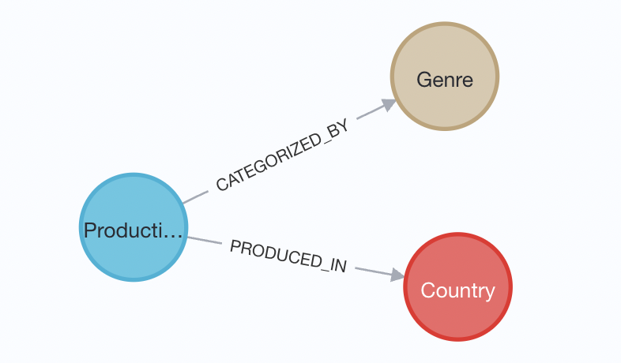

= Java 17 Explore with Neo4j

This is an example application using Spring Data Neo4j and connecting to a Neo4j AuraDB free tier database. You can recreate this project using the following steps:

1. Create a Neo4j AuraDB free instance using https://dev.neo4j.com/aura-java[dev.neo4j.com/aura-java^].

Creating an instance will require creating a user account with Neo4j, but there are no costs for either the account or to create a free tier database instance. Please record the password you create with your instance. It is not shown to you again and will be needed in order to connect the application to the database.

[start=2]
2. Once the database instance is created, load the data in the database.

From the main page in Neo4j AuraDB, there should be a blue button next to the instance. Click this to open Neo4j Browser. At the top of Neo4j Browser window, there is a text input. Copy/paste each statement of the `load-data.cypher` script from this project (`src/main/resources`) into the text input and click the play button on the right.

[start=3]
3. Once data is loaded, clone this project and open in your preferred IDE.

4. Open this project's application.properties file and update with your database's credentials.

The first 3 lines in the application.properties are for URI, username, and password. From the AuraDB console (not Neo4j Browser window), there should be details about your instance, including a line for `Connection URI`. The username is defaulted to `neo4j`, and the password was shown to you when you created the instance.

== Data set

Data is from a https://www.kaggle.com/datasets/victorsoeiro/netflix-tv-shows-and-movies[Kaggle project^].
It contains movie and tvshow titles, along with credits (persons involved), countries, genres, etc. However, for this demo, we are focusing only on the titles themselves (productions).

An example of the data model is shown below.

== Resources
* Neo4j AuraDB: https://dev.neo4j.com/aura-java[Create a FREE instance^]
* Blog post: https://www.baeldung.com/java-sealed-classes-interfaces[Java17 Sealed classes^] (Baeldung)
* Blog post: https://www.baeldung.com/java-switch-pattern-matching[Java17 Switch pattern matching^] (Baeldung)
* Blog post: https://www.baeldung.com/java-instantsource[Java17 InstantSource^] (Baeldung)
* Docs: https://neo4j.com/docs/java-reference/current/extending-neo4j/values-and-types/[Cypher to Java data types^]